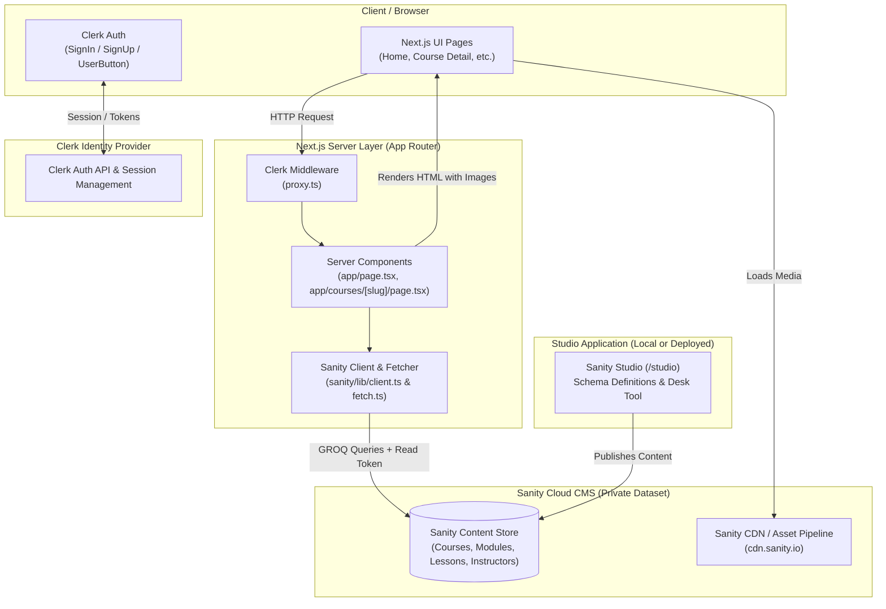
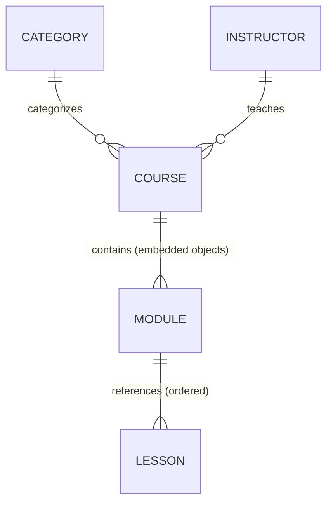

# LearnX — Architecture & System Structure

This document outlines the architecture, data flow, component hierarchy, and integration patterns of **LearnX** as built to date.

---

## 1. High-Level Architecture

LearnX is organized as a decoupled monorepo containing two main parts:
1. **Web Application (Next.js 15 App Router)** at the repository root (`/`).
2. **Sanity Studio v3** in [`/studio`](./studio).



---

## 2. Directory Structure & Responsibilities

```text
LearnX/
├── app/                        # Next.js App Router (Routes & Pages)
│   ├── layout.tsx              # Root layout with ClerkProvider & font setup
│   ├── page.tsx                # Catalog / Homepage (Server Component)
│   ├── courses/[slug]/         # Course details page
│   ├── sign-in/ & sign-up/     # Dedicated Clerk authentication routes
│   └── design-system/          # Living component showcase & style guide
│
├── components/                 # Reusable UI & Feature Components
│   ├── ui/                     # Design system primitives (navigation, button, cards, badges, icons...)
│   ├── home/                   # Home/catalog specific components (HeroSearchBar, CourseIcon)
│   └── course/                 # Course detail components (CourseHero, CourseModuleList, etc.)
│
├── sanity/                     # Web app's Sanity integration layer
│   ├── env.ts                  # Sanity environment config (projectId, dataset, apiVersion)
│   ├── schemaTypes/            # Shared schema type helpers
│   └── lib/
│       ├── client.ts           # Public CDN client vs serverClient (with read token)
│       ├── fetch.ts            # sanityFetch helper with tag-based caching & Draft Mode
│       ├── image.ts            # Image URL builder helper (@sanity/image-url)
│       ├── live.ts             # Live Content API configuration (defineLive)
│       └── queries.ts          # Typed GROQ queries with explicit projections
│
├── studio/                     # Standalone Sanity Studio workspace
│   ├── schemaTypes/            # Sanity schema models (course, lesson, instructor, category, module)
│   ├── sanity.config.ts        # Studio configuration (plugins, structure, tools)
│   └── package.json            # Studio-specific dependencies & build scripts
│
├── proxy.ts                    # Clerk Next.js middleware router
└── next.config.ts              # Next.js configuration (Sanity CDN images, unoptimized images)
```

---

## 3. Data Modeling in Sanity (`studio/schemaTypes`)

The content model forms the core relational hierarchy for courses and curriculum:



### Schema Responsibilities

| Type | Path | Nature | Purpose |
| :--- | :--- | :--- | :--- |
| **`course`** | [`studio/schemaTypes/courseType.ts`](./studio/schemaTypes/courseType.ts) | Document | Root course entity. Holds title, slug, summary, cover image, level, price, popular flag, student count, references to category and instructor, and an array of embedded modules. |
| **`module`** | [`studio/schemaTypes/moduleType.ts`](./studio/schemaTypes/moduleType.ts) | Embedded Object | Embedded within a course. Has title, summary, and an ordered array of references to `lesson` documents. (Module numbers like "Module 1" are derived by index, not stored). |
| **`lesson`** | [`studio/schemaTypes/lessonType.ts`](./studio/schemaTypes/lessonType.ts) | Document | Standalone lesson entity. Holds video URL, poster image, duration in seconds, free preview flag, rich Portable Text notes, key points, and external resources. |
| **`instructor`** | [`studio/schemaTypes/instructorType.ts`](./studio/schemaTypes/instructorType.ts) | Document | Author information with name, slug, photo, expertise, and bio. Referenced by courses. |
| **`category`** | [`studio/schemaTypes/categoryType.ts`](./studio/schemaTypes/categoryType.ts) | Document | Course categorization (e.g. Design, Frontend, Backend, AI). |

---

## 4. Data Access Layer & Security Boundaries

Because LearnX uses a **private Sanity dataset**, data access is strictly gated on the server side:

```
Browser (No Token)
       │
       ▼ (Server Request)
Next.js Server Component (app/page.tsx, app/courses/[slug]/page.tsx)
       │
       ▼ (Uses SANITY_API_READ_TOKEN)
serverClient / sanityFetch (sanity/lib/fetch.ts)
       │
       ▼ (GROQ Query over HTTPS)
Sanity Content Lake
```

### Key Files in `sanity/lib/`

- **[`client.ts`](./sanity/lib/client.ts)**:
  - `client`: Public CDN client (safe for unauthenticated reads if the dataset were public).
  - `serverClient`: Configured with `process.env.SANITY_API_READ_TOKEN` and `useCdn: false`. Only imported in Server Components, server actions, or route handlers.
- **[`fetch.ts`](./sanity/lib/fetch.ts)**:
  - Wraps query execution inside `sanityFetch()`.
  - Automatically handles Draft Mode (previewing unpublished content).
  - Provides helper functions: `getCourses()`, `getCourseBySlug(slug)`.
- **[`live.ts`](./sanity/lib/live.ts)**:
  - Configures `defineLive` from `next-sanity/live`.
  - Provides `<SanityLive />` and live query capabilities using server-side tokens without leaking tokens to the browser.
- **[`queries.ts`](./sanity/lib/queries.ts)**:
  - Centralizes all GROQ queries with `defineQuery`.
  - Uses explicit field projections (never `*[]` whole-document fetches) and dereferences (`category->`, `instructor->`, `lessons[]->`).

---

## 5. Component Architecture & UI Flow

```
app/layout.tsx (Root Layout + ClerkProvider + Fonts)
   │
   ├── app/page.tsx (Catalog Server Component)
   │     ├── Navigation (Header with Search input and Clerk Auth buttons)
   │     ├── Hero Section + HeroSearchBar
   │     ├── Category Filter Tabs
   │     ├── Course Cards Grid (components/ui/cards.tsx)
   │     └── Footer / Stats
   │
   └── app/courses/[slug]/page.tsx (Course Detail Server Component)
         ├── Navigation + Breadcrumbs
         ├── CourseHero (Title, badges, cover image, instructor info, enrollment CTA)
         ├── CourseProgressBar (Visual completion status)
         ├── CourseOutcomes (What you'll learn grid)
         └── CourseModuleList (Accordion of modules with duration and lesson stubs)
```

### Component Categories

1. **Design System Primitives** ([`components/ui/`](./components/ui/)):
   - **`navigation.tsx`**: Header with logo, navigation links, and dynamic Clerk auth buttons (`<SignedIn>`, `<SignedOut>`, `<UserButton>`).
   - **`cards.tsx`**: Course cards with image aspect ratio, badges, instructor avatar, duration, and pricing.
   - **`button.tsx`**, **`badge.tsx`**, **`breadcrumbs.tsx`**, **`icons.tsx`**, **`progress-bar.tsx`**, **`input.tsx`**.
2. **Page Modules**:
   - **`components/home/`**: `HeroSearchBar.tsx`, `CourseIcon.tsx`.
   - **`components/course/`**: `CourseHero.tsx`, `CourseOutcomes.tsx`, `CourseModuleList.tsx`, `CourseProgressBar.tsx`.

---

## 6. Authentication Architecture (Clerk)

- **Middleware**: Defined in [`proxy.ts`](./proxy.ts) using `@clerk/nextjs/server`. Intercepts incoming requests to manage sessions and protect private endpoints.
- **Root Provider**: [`app/layout.tsx`](./app/layout.tsx) wraps the app tree in `<ClerkProvider>`.
- **Dedicated Pages**: Custom auth routes at [`app/sign-in/[[...sign-in]]`](./app/sign-in) and [`app/sign-up/[[...sign-up]]`](./app/sign-up).
- **Public vs. Protected Boundaries**:
  - Catalog browsing and course detail overviews are public.
  - Future learner progress tracking and lesson completion will be keyed by `userId` from Clerk and saved via server routes.

---

## 7. Roadmap & Current Implementation Status

| Feature / Subsystem | Status | Description |
| :--- | :--- | :--- |
| **Sanity Content Model** | ✅ Completed | `course`, `module`, `lesson`, `instructor`, `category` schemas |
| **Dataset Seeding** | ✅ Completed | Realistic multi-module courses with lesson stubs and images |
| **Design System & Primitives** | ✅ Completed | Deep indigo palette, responsive UI primitives, Tailwind |
| **Catalog / Home Page** | ✅ Completed | Live GROQ fetch, category filtering, derived durations |
| **Course Details Page** | ✅ Completed | Static params generation, module accordion, outcomes list |
| **Authentication Integration** | ✅ Completed | Clerk middleware, sign-in/up routes, header state |
| **Lesson Player Page** | ⏳ Next | Lesson view with notes, video embed (YouTube/Vimeo/Bunny) & seeking |
| **Video Intelligence Pipeline** | ⏳ Planned | Offline ingestion creating `video` documents with chunked transcripts |
| **Sanity Context AI Search** | ⏳ Planned | Sanity Context MCP + LLM streaming timestamped video results |
| **Learner Progress & Analytics**| ⏳ Planned | Progress persistence by Clerk ID & PostHog engagement events |
